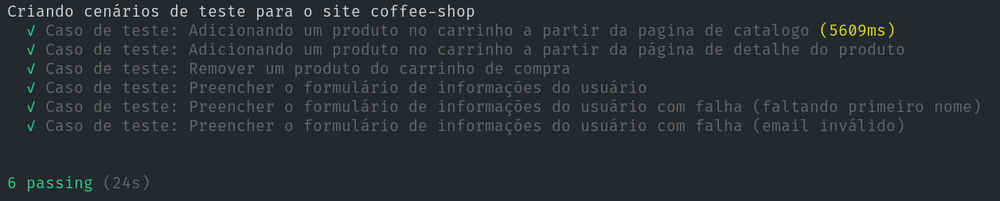

# Projeto de qualidade de software - S206 - Testes com Cypress
### ✏️ Descrição do projeto
    
Este projeto possui testes de interface desenvolvidos com o Cypress, para validar a disciplina de qualidade de software no INATEL.



### 📚 Arquivos importantes do projeto:

- cypress/e2e/spec.cy.js
  - Arquivo com os testes desenvolvidos 

### 🖥️ Site testado:
- [Coffee-Shop](https://coffee-shop-avner.vercel.app)

### ⚙️ Dependências

- [NodeJS](https://nodejs.org)

### 🚀 Executando o projeto

1 - Clone o repositório

``` bash
git clone https://github.com/avnerjose/INATEL-S206-projeto-cypress.git && cd INATEL-S206-projeto-cypress
```

2 - Instalar as dependências 
```bash 
npm i
```

### 🧪 Executando testes Cypress

- Abrir o ambiente do Cypress
```bash
npm run cypress:open 
``` 

- Executar os testes via linha de comando e gerar relatório de testes
```bash 
npm run cypress:run
```
